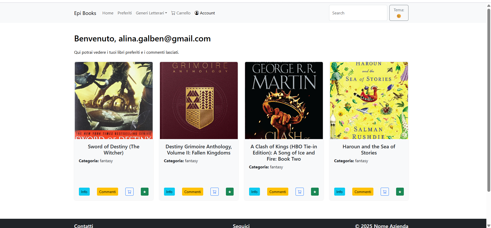

# 📘 EpiBook – Libreria Online | Frontend in React + Vite

Un'applicazione React che simula una libreria online dove gli utenti possono esplorare libri, visualizzare dettagli e gestire i preferiti in modo semplice ed elegante.  
Il progetto è stato avviato con **Vite** per garantire prestazioni elevate e tempi di sviluppo più rapidi.

---
## 📸 Screenshot

| Home Page 📚 | Account Personale 🧾 |
|-------------|-------------------|
|  |  |

---

## 🔍 Funzionalità Principali

- 🔎 **Ricerca dinamica** dei libri  
- 📚 **Visualizzazione delle card** con titolo, immagine e prezzo  
- ⭐ **Gestione dei preferiti** (aggiunta e rimozione in tempo reale)  
- 🧠 **Componente Commenti** per esplorare le recensioni dei libri  
- ⚡ Performance migliorata grazie a Vite

---

## 🛠️ Tech Stack


---

## 🚀 Avvio del Progetto in Locale

1. Clona la repository:
   ```bash
   git clone https://github.com/Alina-Galben/EpiBook-CreataCon-Vite.git
   cd EpiBook-CreataCon-Vite
2. Installa le dipendenze:
   ```bash
   npm install
4. Avvia il server locale:
   ```bash
   npm run dev
6. Apri il browser su:
   ```bash
   http://localhost:5173

---
## 🔐 Nota importante (token richiesto per i Commenti)

La lista dei libri è pubblica e funziona **senza token**.  
Per **leggere/creare/modificare/eliminare commenti** è invece richiesto un **JWT** (token di Strive School).

### Come ottenere il token JWT (Strive School)
1. Vai su https://strive.school/studentlogin  
2. Effettua il login con le tue credenziali.  
3. Copia l’intero token JWT (stringa lunga tipo `xxx.yyy.zzz`).  

---
Poi scegli **una delle due modalità** per fornire il token:

> ## Opzione A — (consigliata) Variabile d’ambiente Vite
> 1. Crea un file .env.local nella root del progetto.
> 2. Incolla: VITE_JWT=Bearer INSERISCI_QUI_IL_TUO_TOKEN
> 3. Nel codice, usa il token con: const token = import.meta.env.VITE_JWT;
>
> ## Opzione B — File di configurazione
> 1. Se preferisci non usare .env, crea src/config/token.js: export const TOKEN = "Bearer INSERISCI_QUI_IL_TUO_TOKEN";
> 2. Poi usa: import { TOKEN as token } from "./config/token";

---

### 📌 Dove viene usato il token in questo progetto
Il token serve solo per le chiamate ai commenti (endpoint /api/comments/...). Inseriscilo nell’header Authorization di tutte le fetch/axios dei commenti:

```js
// ESEMPIO GENERICO (fetch)
await fetch("https://striveschool-api.herokuapp.com/api/comments/<ASIN>", {
  method: "GET/POST/PUT/DELETE",
  headers: {
    "Content-Type": "application/json",
    "Authorization": token, // import.meta.env.VITE_JWT oppure TOKEN dal file di config
  },
  body: JSON.stringify(data) // solo per POST/PUT
});
```
---

### File/Componenti tipici dove mettere l’header
- **src/components/CommentArea.jsx** (lettura commenti di un libro)
- **src/components/AddComment.jsx** (creazione nuovo commento)
- **src/components/CommentList.jsx** e/o src/components/SingleComment.jsx (update/delete)

Se hai chiamate ai commenti altrove, applica lo stesso header.

---

### 🧠 Approfondimenti Tecnici

- Routing gestito con react-router-dom
- Stato locale per la gestione dei preferiti
- Uso efficiente delle props per comunicazione tra componenti
- Progetto didattico sviluppato durante il percorso Epicode – Modulo 5


#### 📩 Contatti
- 🔗 LinkedIn: www.linkedin.com/in/alina-galben
- 📫 Email: alina.galben@gmail.com
- 📍 Disponibile a Catania e provincia, oppure per lavori da remoto!


#### 📄 Licenza
- Progetto open source, creato a scopo formativo.
- Sentiti libero di clonarlo, modificarlo o contribuire! 🌟

